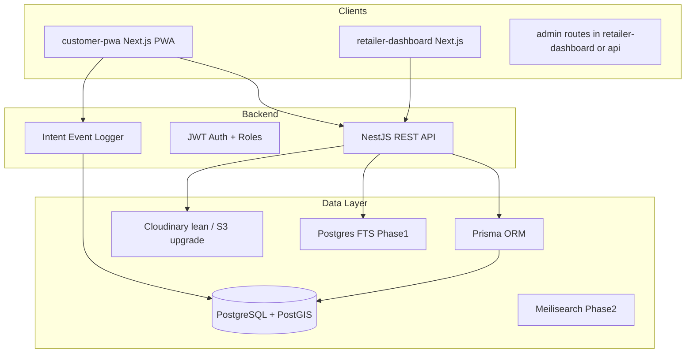
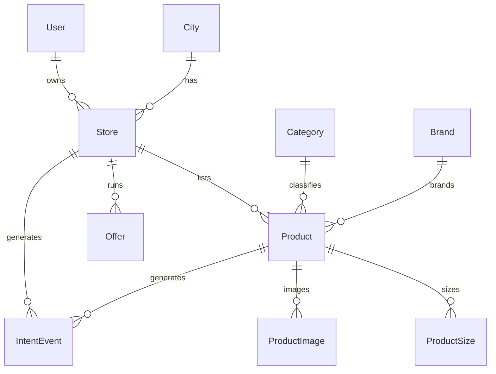

# Local Fashion Commerce Platform — Implementation Plan

## Context and constraints

- **Workspace**: empty greenfield repo at `local fashion commerce platform`
- **First milestone**: **Customer PWA + API** (browse, search, compare, contact stores)
- **Second milestone**: Retailer dashboard + admin verification (shortly after)
- **Infra default**: lean/low-cost; document upgrade path to Meilisearch, Redis, S3

---

## Architecture overview



### Monorepo layout (Turborepo)

```
local-fashion-commerce-platform/
├── apps/
│   ├── customer-pwa/          # Next.js App Router + PWA
│   ├── retailer-dashboard/    # Milestone 2
│   └── api/                     # NestJS
├── packages/
│   ├── shared-types/            # DTOs, enums, API contracts
│   ├── ui/                      # Shared Tailwind components
│   └── eslint-config/           # Optional shared lint
├── prisma/
│   └── schema.prisma            # Single source of truth for DB
├── turbo.json
└── package.json
```

**Why Turborepo**: two Next.js apps + one NestJS app + shared packages; simple caching and task orchestration without Nx complexity.

---

## Data model (finalize first — blocks everything)

Design schema for **comparison and filtering from day one**. Single Prisma schema shared by API; types exported to `packages/shared-types`.

### Core entities

| Entity | Purpose | Key fields |
|--------|---------|------------|
| **User** | Customers, retailers, admins | `role`, `phone`, `cityId` |
| **City** | Pilot locality dimension | `name`, `slug`, `state` |
| **Store** | Retailer storefront | `geo` (PostGIS), `phone`, `whatsapp`, `hours`, `verificationStatus` |
| **Category** | Normalized taxonomy | `parentId`, `slug` (enforce dropdowns, not free text) |
| **Brand** | Normalized brands | `name`, `slug` |
| **Product** | Listings | `storeId`, `categoryId`, `brandId`, `price`, `discountedPrice` |
| **ProductSize** | Per-size stock | `size`, `inStock` |
| **ProductImage** | Media refs | `url`, `sortOrder` |
| **Offer** | Promotions | `storeId`, `type`, `validFrom`, `validTo` |
| **IntentEvent** | Call/WhatsApp/directions taps | `type`, `productId`, `storeId`, `metadata` |



### Schema rules (non-negotiable)

1. **Categories and brands**: FK references only — no free-text on products
2. **Geo**: `Store.location` as `Unsupported("geometry(Point,4326)")` via Prisma raw queries or `@db` extension; index with GIST
3. **Intent events**: append-only log from day one — foundation for retailer analytics
4. **City scoping**: every public query filters by `cityId` (pilot city configurable via env)

---

## API design (NestJS modules)

REST first; module-per-domain:

| Module | Endpoints (MVP) |
|--------|-----------------|
| `auth` | POST `/auth/register`, `/auth/login`, refresh; roles: `customer`, `retailer`, `admin` |
| `cities` | GET `/cities`, GET `/cities/:slug` |
| `stores` | GET `/stores`, `/stores/:id`, `/stores/nearby?lat&lng&radiusKm` |
| `products` | GET `/products` (filters), `/products/:id`, `/products/compare?ids=` |
| `categories` | GET `/categories`, `/brands` |
| `offers` | GET `/offers/active` |
| `intents` | POST `/intents` (call/whatsapp/directions) — **no auth required for MVP** |
| `search` | GET `/search?q=` — Postgres `tsvector` on product title + brand + category |

**Seed strategy**: Prisma seed script with 10–20 mock stores + 100–200 products for one pilot city so customer PWA is usable before retailer dashboard exists.

---

## Customer PWA (Milestone 1)

**Stack**: Next.js 15 App Router, TypeScript, Tailwind, TanStack Query, Zustand (compare shortlist), `@serwist/next` or `next-pwa` for service worker.

### Routes

| Route | Feature |
|-------|---------|
| `/` | City landing, category grid, featured stores |
| `/search` | Text search + filters (price, size, category, brand, distance) |
| `/products/[id]` | Detail: images, sizes, store card, compare button |
| `/compare` | Side-by-side up to 4 products |
| `/stores/[id]` | Store profile, map embed, hours, contact CTAs |
| `/categories/[slug]` | Category browse |

### Hero features

1. **Comparison view**: Zustand store persists selected product IDs; compare page fetches batch via `/products/compare`
2. **Contact CTAs**: `tel:`, `wa.me/<num>?text=...` (prefilled: product name + platform), Google Maps directions link
3. **Intent tracking**: fire-and-forget POST to `/intents` on every CTA click
4. **PWA**: offline app shell, lazy-loaded images (WebP via Cloudinary transforms), install prompt

### SEO (bake in early)

- `generateMetadata` on product and store pages
- JSON-LD `LocalBusiness` + `Product` structured data
- ISR with 60s revalidation for product/store pages

---

## Retailer dashboard (Milestone 2 — shortly after)

**Same monorepo app**: `apps/retailer-dashboard`

| Route | Feature |
|-------|---------|
| `/signup` | Store onboarding (location pin, category tags, hours) |
| `/products` | CRUD list, per-size stock toggle |
| `/products/new` | Single product upload + Cloudinary image picker |
| `/offers` | Simple offer creation |
| `/analytics` | Stub showing intent counts (reads `IntentEvent`) |

**Admin** (minimal): `/admin/stores/pending` — approve/reject new retailers (`verificationStatus` enum).

---

## Infrastructure plan

### Lean MVP (default)

| Service | Choice | Notes |
|---------|--------|-------|
| DB | Neon or Supabase Postgres + PostGIS | Free tier sufficient for pilot |
| API host | Railway or Render | NestJS Docker deploy |
| Frontend | Vercel | Both Next.js apps |
| Images | Cloudinary | Auto WebP, resize on upload |
| Search | Postgres full-text + filters | Upgrade to Meilisearch in Phase 2 |
| Maps | Google Maps Embed + Places (retailer onboarding) | API key in env |
| Auth | JWT + refresh in httpOnly cookie | No Redis needed initially |
| Monitoring | Sentry (errors) | PostHog deferred to Phase 2 |

### Upgrade path (document, don't build yet)

- **Meilisearch**: sync products on create/update via NestJS event emitter
- **Redis**: cache hot search queries + rate limiting
- **S3 + CloudFront**: when Cloudinary costs rise
- **FCM**: push notifications in Phase 2

### CI/CD

GitHub Actions: lint → typecheck → test → deploy preview (Vercel) + API deploy on `main`.

---

## Milestone breakdown

### Milestone 0 — Foundation (Week 1)

- Init Turborepo monorepo with TypeScript, ESLint, Prettier
- Prisma schema + PostGIS migration + seed data (pilot city)
- NestJS API skeleton with auth, stores, products, intents modules
- Shared packages: `shared-types`, base `ui` components (Button, ProductCard, StoreCard)

### Milestone 1 — Customer PWA + API (Weeks 2–4)

- Product browse, search, filters, detail pages
- Compare view (Zustand + batch API)
- Store profile with map + contact CTAs
- Intent event tracking on all CTAs
- PWA shell + offline caching
- Deploy to Vercel + Railway with pilot seed data

### Milestone 2 — Retailer dashboard (Weeks 5–6)

- Retailer signup/onboarding with geo pin
- Product upload/edit/delete + stock toggle
- Basic offer creation
- Admin store verification flow

### Milestone 3 — Pilot launch prep (Week 7)

- Onboard 10–20 real retailers (manual seed or dashboard)
- Replace/augment mock data
- Performance pass (Lighthouse on mid-range Android targets)
- Basic Sentry + uptime monitoring

---

## Key design decisions locked in

1. **Comparison is the hero** — compare state in client, batch fetch API, schema supports cross-store filtering
2. **Intent events = conversion proxy** — log every call/WhatsApp/directions tap from day one
3. **Taxonomy enforced early** — categories/brands as normalized tables with admin-seeded values
4. **No payments/delivery** — explicitly out of scope for MVP
5. **Customer-first delivery** — seed data unblocks PWA before retailer tools exist

---

## Risks and mitigations

| Risk | Mitigation |
|------|------------|
| Empty marketplace at launch | Seed 10–20 stores before customer launch; onboard retailers manually in Milestone 3 |
| Stale stock data | Per-size toggle UX in retailer dashboard; WhatsApp update flow in Phase 2 |
| Slow search on Postgres | Lean FTS suffices for pilot; Meilisearch upgrade path ready |
| PostGIS complexity | Use raw SQL helpers in NestJS repository layer; test with pilot city coords |

---

## Immediate next actions (after plan approval)

1. Scaffold Turborepo monorepo with `apps/api`, `apps/customer-pwa`, `packages/shared-types`, `packages/ui`
2. Write Prisma schema and run first migration with PostGIS
3. Create seed script for one pilot city (configurable via `PILOT_CITY_SLUG` env)
4. Implement core read APIs: stores, products (with filters), compare, intents
5. Build customer PWA pages: home, search, product detail, compare, store profile
